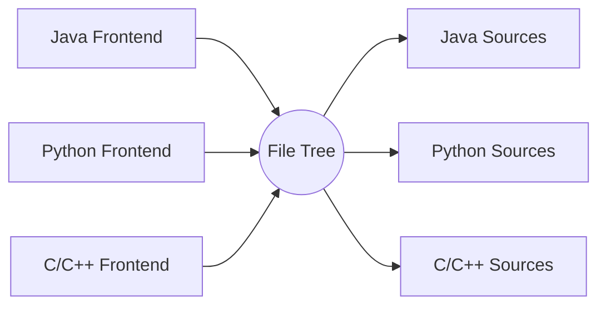
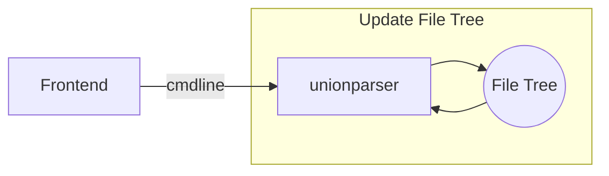
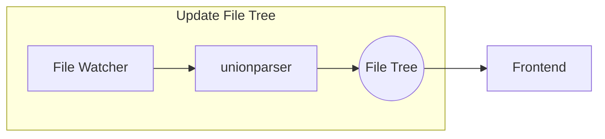
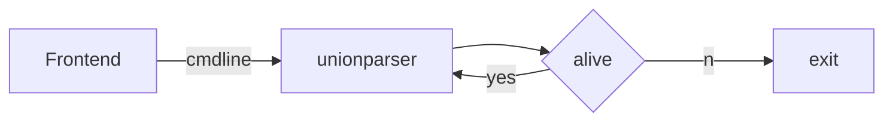
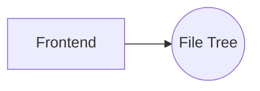

# `unionparser`
- Parsing program that separate programming language symbols from text, such as C++/Java/Python,  It is expected to integrate any programming language that can be text.
- It is a back-end program，Implemented using the so easy `IDE` integration from file tree

## Schematic Diagram of Frame
- display symbol file tree

- Parser source files from initialize

- Watch source files changed

- Parent process watcher

- Query language tokens

