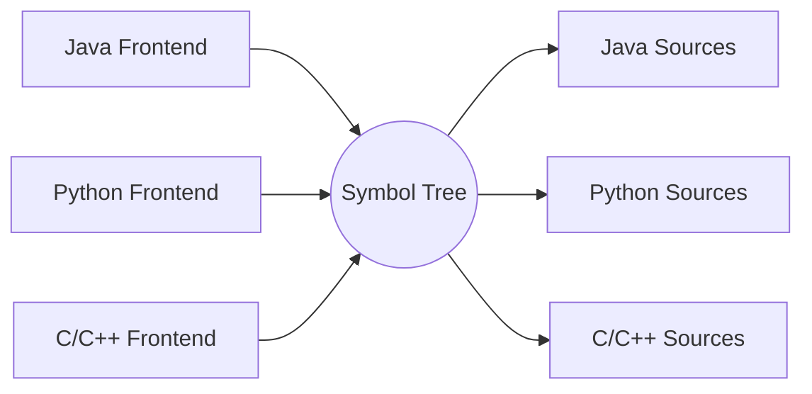
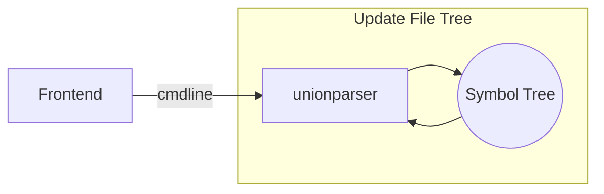
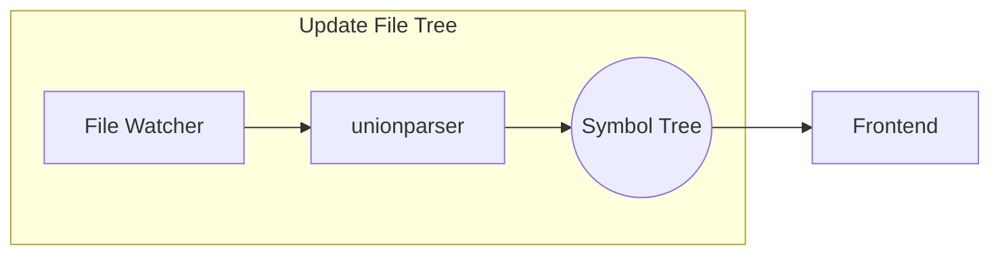
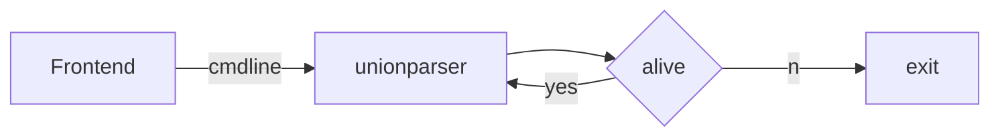
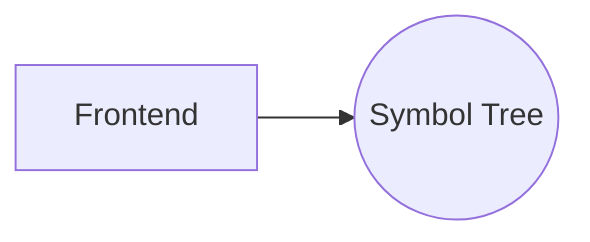
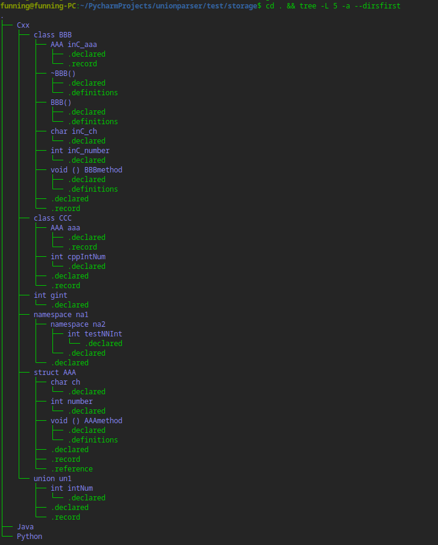
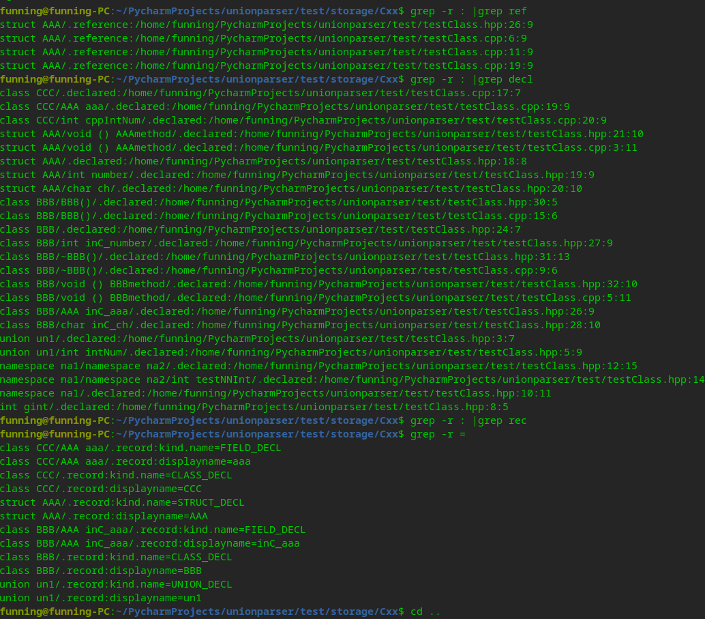

# `unionparser`
- Parsing program that separate programming language symbols from text, such as C++/Java/Python,  It is expected to integrate any programming language that can be text.
- It is a back-end program，Implemented using the so easy `IDE` integration from file tree
- It will solve the problem of symbols in the strong workspace mode of the IDE. Because LSP services are usually used as the back-end in existing IDEs, and symbols can be synchronized only when documents are opened. You cannot get all the symbols when you open the workspace at the beginning.
- For the current program, try to keep the current program lightweight, and only support the symbols in the source file. If you need any symbols other than the source file, it is not supported. If you want to obtain relevant support, you can check the relevant usage of the document/symbol of the native LSP Server.


## Schematic Diagram of Frame
- display symbol file tree


- Parser source files from initialize



- Watch source files changed



- Parent process watcher



- Query language tokens



# usage

- Can to use show help option, there are detailed instructions:

```
(venv) funning@funning-PC:~/PycharmProjects/unionparser$ python3 __main__.py -h
llvm configure lib directory:/usr/lib/llvm-7/lib

usage: __main__.py [-h] -s STORAGE [-w WORKSPACE] [-l {C,C++,Java,Python}]
                   [-j JOB] [-v]
                   [--log-config LOG_CONFIG | --log-file LOG_FILE]

Union Parser

optional arguments:
  -h, --help            show this help message and exit
  -s STORAGE, --storage STORAGE
                        storage path from do parse language files result saved
  -w WORKSPACE, --workspace WORKSPACE
                        language source files root path, same LSP workspace,
                        default is program path.
  -l {C,C++,Java,Python}, --language {C,C++,Java,Python}
                        select workspace language type files. It is blank by
                        default. If no language is specified, all supported
                        languages will be processed.
  -j JOB, --job JOB     The number of tasks to be started is generally not
                        required to be specified. By default, it is consistent
                        with the number of CPUs
  -v, --verbose         Increase verbosity of log output, overrides log config
                        file.
  --log-config LOG_CONFIG
                        Path to a JSON file containing Python logging config.
  --log-file LOG_FILE   Redirect logs to the given file instead of writing to
                        stderr.Has no effect if used with --log-config.
```

- Use command to parse source:

```bash
python3 __main__.py --storage ./test/storage --workspace ./test
```

generate symbol tree to `./test/storage`  path，like same:



- Query source tokens

  can to use `grep -r : |grep reference`  or argument `declared`，for:

  
