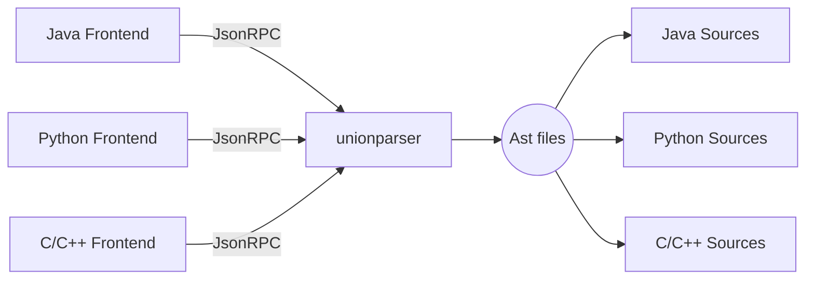
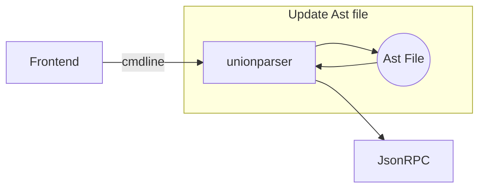
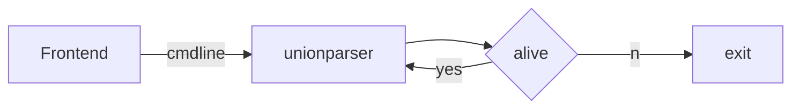
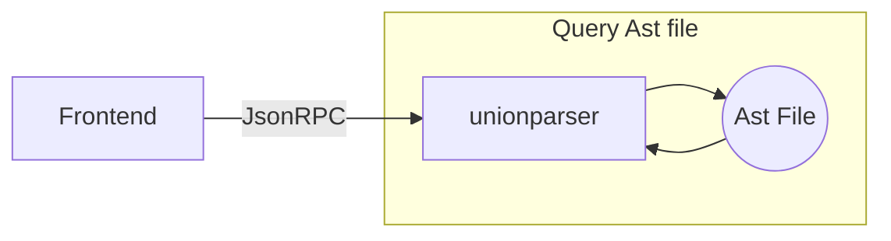

# `unionparser`
- Parsing libraries that separate programming language symbols from text, such as C++/Java/Python,  It is expected to integrate any programming language that can be text.
- It is a back-end program，Implemented using the most popular `IDE` integration protocol `JsonRPC`

## Schematic Diagram of Frame
- All calls are implemented through `JsonRPC` access

- Parser source files from initialize

- Watch source files changed

- Parent Process watcher

- Query language tokens

