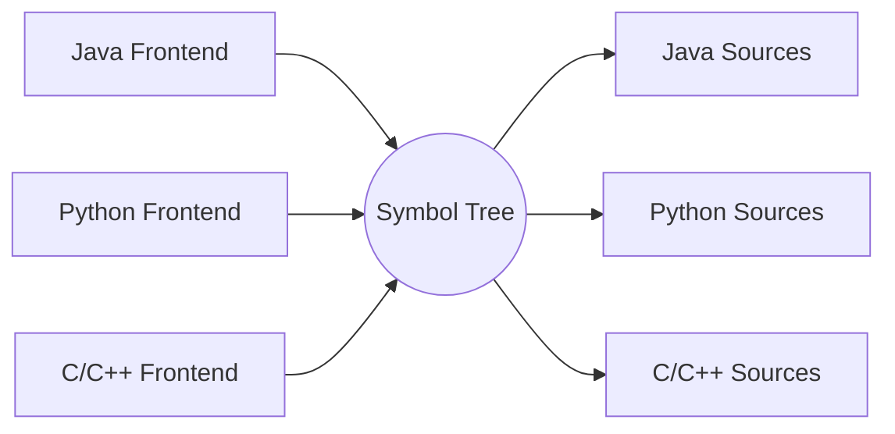
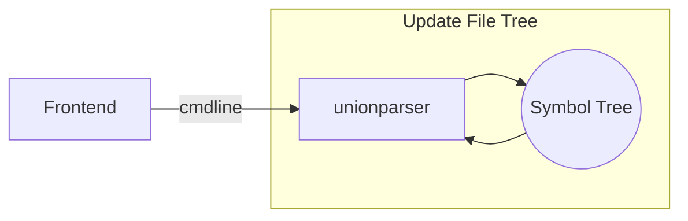
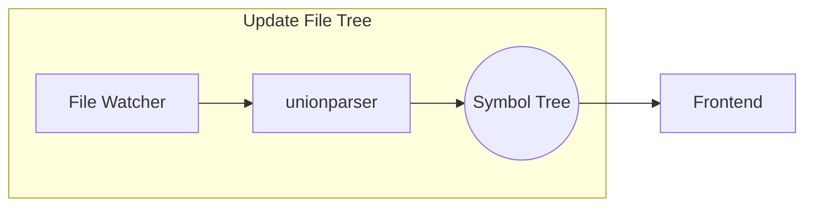
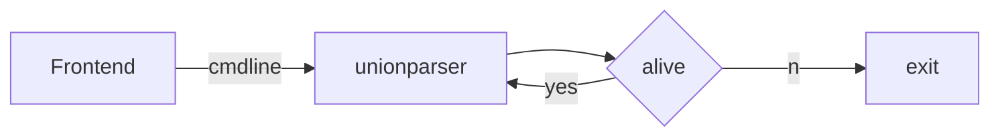
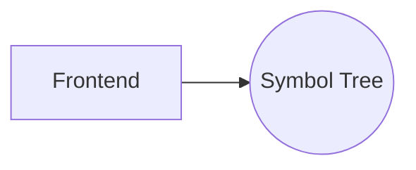

# `unionparser`
- Parsing program that separate programming language symbols from text, such as C++/Java/Python,  It is expected to integrate any programming language that can be text.
- It is a back-end program，Implemented using the so easy `IDE` integration from file tree
- It will solve the problem of symbols in the strong workspace mode of the IDE. Because LSP services are usually used as the back-end in existing IDEs, and symbols can be synchronized only when documents are opened. You cannot get all the symbols when you open the workspace at the beginning.
- For the current program, try to keep the current program lightweight, and only support the symbols in the source file. If you need any symbols other than the source file, it is not supported. If you want to obtain relevant support, you can check the relevant usage of the document/symbol of the native LSP Server.

## Schematic Diagram of Frame
- display symbol file tree

- Parser source files from initialize

- Watch source files changed

- Parent process watcher

- Query language tokens

